### Задание 1

Для того, чтобы получить служебную инфрормацию пакета надо воспользоваться командой ```pip show <package_name>```.

**Решение**:

```bash
pip show matplotlib
```

В качестве ответа получаем служебную информацию:
```bash
Name: matplotlib
Version: 3.9.2
Summary: Python plotting package
Home-page: 
Author: John D. Hunter, Michael Droettboom
Author-email: Unknown <matplotlib-users@python.org>
License: License agreement for matplotlib versions 1.3.0 and later
```

Для того, чтобы получить пакет, не используя пакетный менеджер, можно клонировать репозиторий к себе, а затем прописать ```python setup.py install```.

### Задание 2

Для того, чтобы получить служебную информацию пакета надо воспользоваться командой ```npm info <package_name>```.

**Решение**:

```bash
npm info express
```

В качестве ответа получим служебную информацию:
```bash
express@4.19.2 | MIT | deps: 31 | versions: 276
Fast, unopinionated, minimalist web framework
http://expressjs.com/

keywords: express, framework, sinatra, web, http, rest, restful, router, app, api

dist
.tarball: https://registry.npmjs.org/express/-/express-4.19.2.tgz
.shasum: e25437827a3aa7f2a827bc8171bbbb664a356465
.integrity: sha512-5T6nhjsT+EOMzuck8JjBHARTHfMht0POzlA60WV2pMD3gyXw2LZnZ+ueGdNxG+0calOJcWKbpFcuzLZ91YWq9Q==
.unpackedSize: 214.8 kB
...
```

Для установки пакета напрямую из репозитория надо клонировать этот репозиторий к себе, а затем прописать команду ```npm install```.


### Задание 3

**Граф для matplotlib**:
```
digraph G {
  node [shape=rect];

  "matplotlib" -> "numpy";
  "matplotlib" -> "pillow";
  "matplotlib" -> "cycler";
  "matplotlib" -> "kiwisolver";
  "matplotlib" -> "pyparsing";
  "matplotlib" -> "python-dateutil";
}
```


**Граф для express**:

```dot
digraph G {
  node [shape=rect];

  "express" -> "accepts";
  "express" -> "array-flatten";
  "express" -> "body-parser";
  "express" -> "content-disposition";
  "express" -> "cookie";
  "express" -> "cookie-signature";
  "express" -> "debug";
  "express" -> "depd";
  "express" -> "encodeurl";
  "express" -> "escape-html";
  "express" -> "etag";
  "express" -> "finalhandler";
  "express" -> "fresh";
  "express" -> "merge-descriptors";
  "express" -> "methods";
  "express" -> "on-finished";
  "express" -> "parseurl";
  "express" -> "path-to-regexp";
  "express" -> "proxy-addr";
  "express" -> "qs";
  "express" -> "range-parser";
  "express" -> "safe-buffer";
  "express" -> "send";
  "express" -> "serve-static";
  "express" -> "setprototypeof";
  "express" -> "statuses";
  "express" -> "type-is";
  "express" -> "utils-merge";
  "express" -> "vary";
}
```




### Задание 4

