### Задание 1

Для того, чтобы получить служебную инфрормацию пакета надо воспользоваться командой ```pip show <package_name>```.

**Решение**:

```bash
pip show matplotlib
```

В качестве ответа получаем служебную информацию:
```bash
Name: matplotlib
Version: 3.9.2
Summary: Python plotting package
Home-page: 
Author: John D. Hunter, Michael Droettboom
Author-email: Unknown <matplotlib-users@python.org>
License: License agreement for matplotlib versions 1.3.0 and later
```

Для того, чтобы получить пакет, не используя пакетный менеджер, можно клонировать репозиторий к себе, а затем прописать ```python setup.py install```.

### Задание 2

Для того, чтобы получить служебную информацию пакета надо воспользоваться командой ```npm info <package_name>```.

**Решение**:

```bash
npm info express
```

В качестве ответа получим служебную информацию:
```bash
express@4.19.2 | MIT | deps: 31 | versions: 276
Fast, unopinionated, minimalist web framework
http://expressjs.com/

keywords: express, framework, sinatra, web, http, rest, restful, router, app, api

dist
.tarball: https://registry.npmjs.org/express/-/express-4.19.2.tgz
.shasum: e25437827a3aa7f2a827bc8171bbbb664a356465
.integrity: sha512-5T6nhjsT+EOMzuck8JjBHARTHfMht0POzlA60WV2pMD3gyXw2LZnZ+ueGdNxG+0calOJcWKbpFcuzLZ91YWq9Q==
.unpackedSize: 214.8 kB
...
```

Для установки пакета напрямую из репозитория надо клонировать этот репозиторий к себе, а затем прописать команду ```npm install```.


### Задание 3

**Граф для matplotlib**:
```
digraph G {
  node [shape=rect];

  "matplotlib" -> "numpy";
  "matplotlib" -> "pillow";
  "matplotlib" -> "cycler";
  "matplotlib" -> "kiwisolver";
  "matplotlib" -> "pyparsing";
  "matplotlib" -> "python-dateutil";
}
```


**Граф для express**:

```dot
digraph G {
  node [shape=rect];

  "express" -> "accepts";
  "express" -> "array-flatten";
  "express" -> "body-parser";
  "express" -> "content-disposition";
  "express" -> "cookie";
  "express" -> "cookie-signature";
  "express" -> "debug";
  "express" -> "depd";
  "express" -> "encodeurl";
  "express" -> "escape-html";
  "express" -> "etag";
  "express" -> "finalhandler";
  "express" -> "fresh";
  "express" -> "merge-descriptors";
  "express" -> "methods";
  "express" -> "on-finished";
  "express" -> "parseurl";
  "express" -> "path-to-regexp";
  "express" -> "proxy-addr";
  "express" -> "qs";
  "express" -> "range-parser";
  "express" -> "safe-buffer";
  "express" -> "send";
  "express" -> "serve-static";
  "express" -> "setprototypeof";
  "express" -> "statuses";
  "express" -> "type-is";
  "express" -> "utils-merge";
  "express" -> "vary";
}
```




### Задание 4

```
include "globals.mzn";

array[1..6] of var 0..9: numbers;
constraint all_different(numbers);

var int: FirstSum = sum(numbers[1..3]);
constraint FirstSum == sum(numbers[4..6]);

solve minimize FirstSum;

output ["Билет - ", show(numbers), " Сумма 3х цифр - ", show(FirstSum)];
```

### Задание 5

```
set of int: MenuVersions = 1..6;
set of int: DropdownVersions = 1..5;
set of int: IconVersions = 1..2;

array[MenuVersions] of int: menu = [150, 140, 130, 120, 110, 100];
array[DropdownVersions] of int: dropdown = [230, 220, 210, 200, 180];
array[IconVersions] of int: icons = [200, 100];

var MenuVersions: selected_menu;
var DropdownVersions: selected_dropdown;
var IconVersions: selected_icons;

constraint
    (selected_menu = 1 -> selected_dropdown in 1..3) /\
    (selected_menu = 2 -> selected_dropdown in 2..4) /\
    (selected_menu = 3 -> selected_dropdown in 3..5) /\
    (selected_menu = 4 -> selected_dropdown in 4..5) /\
    (selected_menu = 5 -> selected_dropdown = 5) /\
    (selected_dropdown = 1 -> selected_icons = 1) /\
    (selected_dropdown = 2 -> selected_icons in 1..2) /\
    (selected_dropdown = 3 -> selected_icons in 1..2) /\
    (selected_dropdown = 4 -> selected_icons in 1..2) /\
    (selected_dropdown = 5 -> selected_icons in 1..2);

solve satisfy;

output [
    "Selected menu version: \(menu[selected_menu])\n",
    "Selected dropdown version: \(dropdown[selected_dropdown])\n",
    "Selected icon version: \(icons[selected_icons])\n"
];
```

***Вывод:***


### Задание 6

```
var 0..1: foo_min;
var 1..9: foo_maj;

var 0..9: target_min;
var 1..9: target_maj;

var 0..9: left_min;
var 1..9: left_maj;

var 0..9: right_min;
var 1..9: right_maj;

var 0..9: shared_min;
var 1..9: shared_maj;

constraint foo_maj == 1;

constraint target_maj == 2;

constraint (
if foo_min == 1
then left_maj = 1 /\ right_maj = 1
else true
endif
);

constraint (
if left_maj == 1
then shared_maj >= 1
else true
endif
);

constraint (
if right_maj == 1
then shared_maj < 2
else true
endif
);

constraint (
if shared_maj == 1
then target_maj = 1
else true
endif
);

output [
"foo ", show(foo_maj), ".", show(foo_min), ".0\n",
"target ", show(target_maj), ".", show(target_min), ".0\n",
"left ", show(left_maj), ".", show(left_min), ".0\n",
"right ", show(right_maj), ".", show(right_min), ".0\n",
"shared ", show(shared_maj), ".", show(shared_min), ".0"
];
```

***Вывод:***


### Задание 7

```
int: num_packages;

set of int: Packages = 1..num_packages;

array[Packages] of set of int: Versions;

array[Packages] of var int: selected_version;

array[Packages] of set of int: dependencies;

array[Packages, Packages] of int: min_version;

array[Packages, Packages] of int: max_version;

constraint
  forall(i in Packages) (
    forall(dep in dependencies[i]) (
      selected_version[dep] >= min_version[i, dep] /\
      selected_version[dep] <= max_version[i, dep]
    )
  );

solve satisfy;
```
